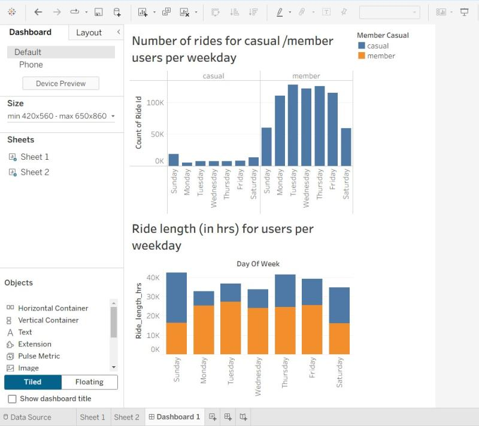

# 🚲 Cyclistic Bike-Share Case Study

## Project Overview

This project analyzes bike-share usage data from **Cyclistic** to identify behavioral differences between **casual riders** and **annual members**.

The objective is to generate insights that can support marketing strategies aimed at **converting casual riders into annual members**.

The complete workflow and analysis are available in the Jupyter notebook included in this repository (case-study.ipynb).

---

## Dataset

* **Source:** Divvy / Cyclistic Bike-Share Data
* **Period Analyzed:** Q1 2019 – Q1 2020
* Includes ride-level data such as trip duration, timestamps, station information, and rider type.

---

## Tools & Technologies

* **Python**
* **Jupyter Notebook**
* **Pandas**
* **NumPy**
* **Matplotlib / Seaborn**

---

## Skills Demonstrated

* Data Cleaning
* Exploratory Data Analysis (EDA)
* Data Visualization
* Behavioral Pattern Analysis
* Translating Data into Business Insights

---

## Example Visualization



Example visualization highlighting differences in ride behavior between casual riders and annual members.

---

## Key Insights

* **Casual riders** take longer rides and are most active on weekends.
* **Annual members** ride more frequently with shorter trip durations.
* Usage patterns indicate **leisure behavior for casual riders** and **commuting behavior for members**.

---

## Business Recommendations

* Launch **weekend marketing campaigns** targeting casual riders.
* Offer **trial memberships or limited-time upgrades**.
* Promote **member benefits** for frequent riders and commuters.

---

## Repository Structure

```
cyclistic-bike-share-case-study
│
├── case-study.ipynb
├── README.md
└── images
    └── cyclistic-analysis.png
├── data.zip
```

---

## Author

Mohammed Hussein
